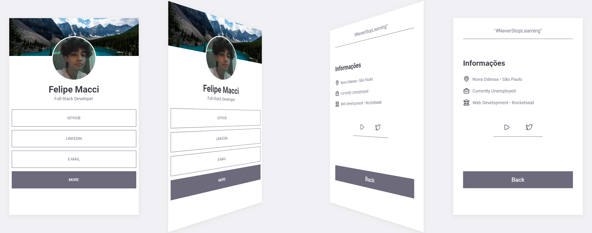

<h1 align="center">MACCI SOCIAL TREE 🔗</h1>
<h3 align="center">CUSTOMIZE YOUR SOCIAL TREE CARD</h3>

 

    

 

#### RELEASE NOTES: V1.0.0:
- First version of the project 🎉
- Customize your social tree however you like
- "See more" system with rotation
- Responsive Application

 

#### TECHNOLOGIES:
- HTML 📄
- CSS 🎨
- JAVASCRIPT 💻

 

<h5 align="center">Felipe Macci</h5>