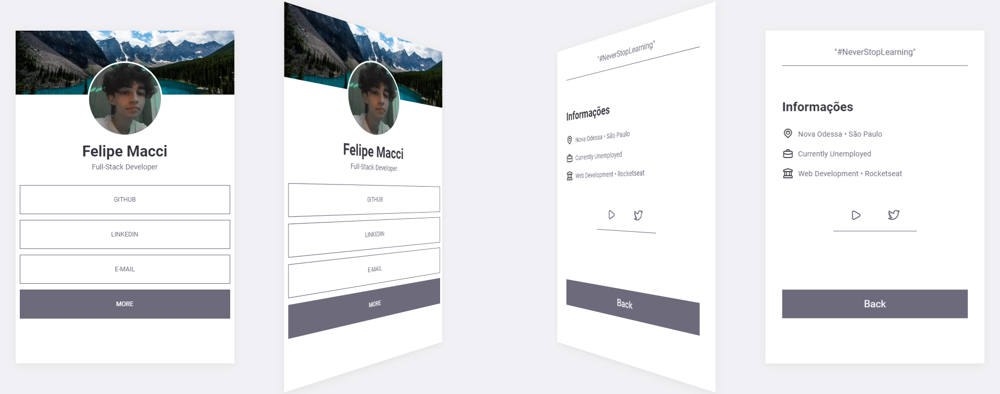

<h1 align="center">MACCI SOCIAL TREE 🔗</h1>
<h3 align="center">PERSONALIZE SEU CARD SOCIAL TREE</h3>

 

    

 

#### NOTAS DE VERSÃO: V1.0.0:
- Primeira versão do projeto 🎉
- Personalize sua social tree como quiser
- Sistema de "Ver mais" com rotação
- Aplicação Responsiva

 

#### TECNOLOGIAS:
- HTML 📄
- CSS 🎨
- JAVASCRIPT 💻

 

<h5 align="center">Felipe Macci</